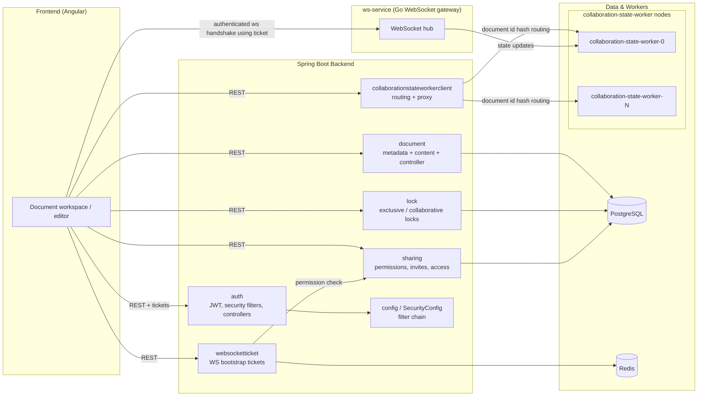
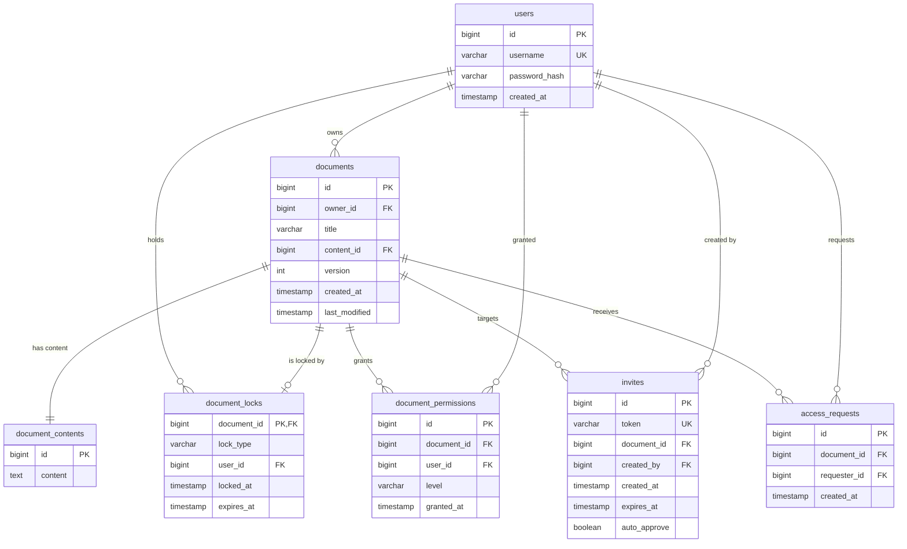

# Architecture Overview

This document provides a high-level overview of the **collab-editor** application, focusing on the Spring Boot backend. It is the entry point to the rest of the documentation set.

## Table of Contents

| Document | Topic |
| --- | --- |
| [user-auth.md](./user-auth.md) | Authentication, JWT and the security filter chain |
| [documents.md](./documents.md) | Document and document content persistence, document locks |
| [sharing.md](./sharing.md) | Permissions, invites and access requests |
| [internal-worker.md](./internal-worker.md) | Internal auth, worker routing and the collaboration proxy service |
| [ws-ticket.md](./ws-ticket.md) | Websocket ticket (bootstrap handshake) flow |

---

## System Overview

`collab-editor` is a collaborative document editor. A set of **Angular** frontends talk to a **Spring Boot** backend, which is responsible for the majority of the application logic:

- **Authentication & authorization** — JWT-based auth, role/permission resolution, and a ticket flow that lets frontends authenticate WebSocket connections without leaking credentials into URLs.
- **Document lifecycle** — creating, reading and persisting documents, with the document body stored separately from its metadata because the content is disproportionately large.
- **Concurrency control** — document locking (exclusive and collaborative) so that multiple users can share a document without clobbering each other's edits.
- **Sharing** — granular permission levels, invite links and access-request approval.
- **Collaboration** — proxying document state to and from the `collaboration-state-worker` nodes, including load-balancing decisions based on the document id.

### External systems

- **PostgreSQL** — primary data store for the backend (users, documents, permissions, invites, access requests and locks).
- **Redis** — used by the websocket ticket flow to store a short-lived, opaque ticket alongside its associated user/document/permission context.
- **`collaboration-state-worker`** — a set of nodes that own the live collaborative state for a document during a session. The backend never lets the frontend talk to a worker directly; it always goes through the backend proxy.
- **`ws-service`** — the WebSocket gateway written in Go that frontends connect to for the realtime session.

---

## Main Components

The diagram below shows the Spring Boot backend's major packages and how the frontend and the external services fit around it.

---

## Data Model (ER)

The backend persists its core domain in PostgreSQL. The entities live under
`src/main/java/com/somedomain/collab_editor/`. A summary of the model:

- **`users`** (`auth/User.java`) — application users; implements Spring Security's `UserDetails`.
- **`documents`** (`document/Document.java`) — document metadata; each document belongs to one owner.
- **`document_contents`** (`document/DocumentContent.java`) — the (large) body of a document, held in a separate table.
- **`document_locks`** (`lock/DocumentLock.java`) — an optional, one-to-one per-document lock that gates editing.
- **`document_permissions`** (`permission/DocumentPermission.java`) — grants a user a permission level on a document.
- **`invites`** (`invite/Invite.java`) — shareable invite tokens for a document.
- **`access_requests`** (`access/AccessRequest.java`) — pending requests from users asking for access to a document.

See [documents.md](./documents.md) and [sharing.md](./sharing.md) for the detailed notes behind each entity.