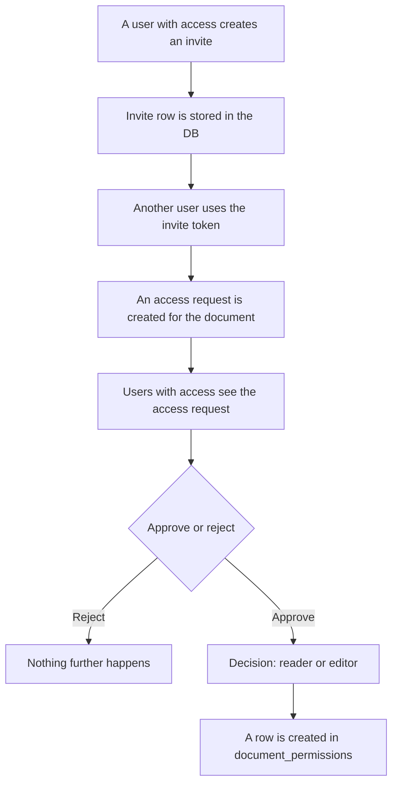

# Sharing: Permissions, Invites & Access Requests

This document describes how documents are shared between users: the permission model, invite links and the access-request approval flow.

## Permissions

The `DocumentPermission` entity (`permission/DocumentPermission.java`) grants a user a given level of access on a document.

Table: `document_permissions`

| Column | Type | Notes |
| --- | --- | --- |
| `id` | `bigint` | PK, auto-generated |
| `document_id` | `bigint` | FK → `documents`, NOT NULL, lazy |
| `user_id` | `bigint` | FK → `users`, NOT NULL, lazy |
| `level` | `varchar` | enum string, NOT NULL (`PermissionLevel`) |
| `granted_at` | `timestamp` | NOT NULL, defaults to now |

**Unique constraint:** `uc_doc_user` on `(document_id, user_id)`.

> **Design note:** Ideally the primary key would be a composite key of `(document_id, user_id)`, but that proved too complicated, so a surrogate key is used instead. The unique constraint is still enforced at the table level via `uc_doc_user`.

### Permission levels (`permission/PermissionLevel.java`)

| Level | Capabilities |
| --- | --- |
| `OWNER` | Can delete the document, plus everything below. |
| `EDITOR` | Can write, plus everything below. |
| `VIEWER` | Can read and share. |

Permissions are cumulative: each level includes all capabilities of the levels below it.

## Invites

The `Invite` entity (`invite/Invite.java`) represents a shareable link (`token`) to a document.

Table: `invites`

| Column | Type | Notes |
| --- | --- | --- |
| `id` | `bigint` | PK, auto-generated |
| `token` | `varchar` | NOT NULL, **unique**, indexed via `idx_invite_token` |
| `document_id` | `bigint` | FK → `documents`, NOT NULL, lazy |
| `created_by` | `bigint` | FK → `users`, nullable (usually the owner) |
| `created_at` | `timestamp` | NOT NULL, defaults to now |
| `expires_at` | `timestamp` | defaults to now + 3 hours |
| `auto_approve` | `boolean` | if true, validating the invite grants access directly |

Key points:

- The `token` is **unique** and searchable via `idx_invite_token`.
- Invites **expire** (default `3 hours`).
- If `autoApprove` is `true`, validating an invite grants access directly, skipping the access-request step.
- **Currently invites are not single-use.**

## Access requests

The `AccessRequest` entity (`access/AccessRequest.java`) records a user requesting access to a document.

Table: `access_requests`

| Column | Type | Notes |
| --- | --- | --- |
| `id` | `bigint` | PK, auto-generated |
| `document_id` | `bigint` | FK → `documents`, NOT NULL, indexed |
| `requester_id` | `bigint` | FK → `users`, NOT NULL, indexed |
| `created_at` | `timestamp` | NOT NULL, defaults to now |

## Sharing flow

The high-level sharing flow (assuming `autoApprove` is **off**) looks like this:

## Related docs

- [user-auth.md](./user-auth.md) — how users are authenticated before using an invite.