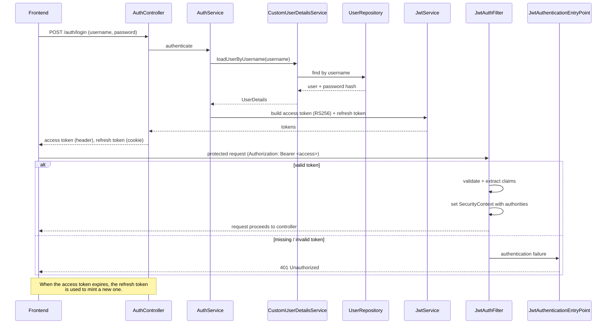

# User Authentication & Authorization

This document describes how users authenticate with the Spring Boot backend and how authorization is enforced across requests.

## Overview

Authentication is a standard JWT-based flow. On signup or login the backend issues:

- a **short-lived access token** (default `15 minutes`) returned in the response headers, and
- a **long-lived refresh token** (default `7 days`) stored in a cookie.

The access token is expected on the `Authorization` header for protected requests. The refresh token is used only to mint new access tokens when the current one expires.

## Components

| Component | File | Responsibility |
| --- | --- | --- |
| `User` | `src/main/java/com/somedomain/collab_editor/auth/User.java` | Application user. Implements Spring Security's `UserDetails` so the framework can read username, password and authorities. |
| `CustomUserDetailsService` | `src/main/java/com/somedomain/collab_editor/auth/CustomUserDetailsService.java` | Required by Spring Security; loads user details from `UserRepository`. |
| `UserRepository` | `src/main/java/com/somedomain/collab_editor/auth/UserRepository.java` | Spring Data repository for `User`. |
| `PasswordConfig` | `src/main/java/com/somedomain/collab_editor/auth/PasswordConfig.java` | Abstraction over the password encoder used to hash passwords at rest. |
| `JwtService` | `src/main/java/com/somedomain/collab_editor/auth/JwtService.java` | Generates, validates and extracts claims from JWT tokens. |
| `JwtAuthFilter` | `src/main/java/com/somedomain/collab_editor/auth/JwtAuthFilter.java` | Per-request filter that parses the access token and populates the security context. |
| `JwtAuthenticationEntryPoint` | `src/main/java/com/somedomain/collab_editor/auth/JwtAuthenticationEntryPoint.java` | Returns an unauthorized response when a protected request has no valid authentication. |
| `AuthService` | `src/main/java/com/somedomain/collab_editor/auth/AuthService.java` | Application-level auth logic (signup, login, refresh). |
| `AuthController` | `src/main/java/com/somedomain/collab_editor/auth/AuthController.java` | Exposes the auth endpoints (`/auth/...`). |
| `SecurityConfig` | `src/main/java/com/somedomain/collab_editor/config/SecurityConfig.java` | Wires the filter chain, CSRF, routing rules and CORS. |

## JWT structure

Tokens are signed with **RS256** using a private/public key pair read from `application.yaml` (under `jwt.private-key` and `jwt.public-key`). A token built by `JwtService` contains the following claims:

| Claim | Contents |
| --- | --- |
| **subject** | the username |
| **`userId`** | the primary key of the user |
| **`roles`** | the user's granted authorities |
| **`issuedAt`** | the token's creation time |
| **`expiration`** | the token's expiry, set from the configured lifetime |

## Security configuration

`SecurityConfig`:

- attaches `JwtAuthFilter` to the filter chain,
- disables CSRF (access tokens are sent in headers, not cookies),
- protects all routes **except** `/auth` (login/signup),
- configures CORS. Currently the allowed origins are hard-coded.

## Unauthorized handling

Because the authorization gate runs within the filter chain (outside the regular request-handling path), the global exception handler cannot be relied upon. `JwtAuthenticationEntryPoint` returns a proper `401 Unauthorized` response instead.

## `/me` endpoint

`AuthController` exposes a `/me` route that returns current-user information to the frontend.

> **Note:** The current implementation obtains the user info from the security context directly and may be flawed; it should be rechecked later.

## Diagram

## Related docs

- [ws-ticket.md](./ws-ticket.md) — how WebSocket connections authenticate reusing the permission model.