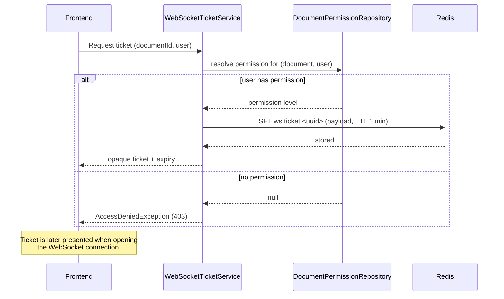

# WebSocket Tickets

This document describes the ticket flow used to bootstrap an authenticated WebSocket connection.

## What is a ticket?

A ticket is an **opaque, short-lived value** that the backend creates and returns to the frontend. Creating a ticket is a two-part operation handled by `WebSocketTicketService` (`websocketticket/WebSocketTicketService.java`):

1. An entry is written to **Redis**, and
2. The opaque ticket key is returned to the caller.

## Why this pattern exists?

WebSocket **connection-initialization requests do not support custom headers** (including auth headers). That means the auth token would otherwise have to be passed as a route/query parameter, which leaks credentials into URLs — a bad practice.

The ticket is a safe alternative: it is exchanged up front over a normal authenticated REST call, and then presented when the WebSocket connection is opened.

## What is stored with the ticket?

Along with the ticket, the backend stores the **user id**, **document id** and the user's **permission level** for that document in Redis. Binding this context to the ticket guarantees that:

- no other user can use the ticket, and
- the ticket is tied to a specific document and permission.

## Ticket format

The ticket key is a **random UUID** (hyphens stripped), stored in Redis under `ws:ticket:<ticket>` with a short TTL (`WebSocketTicketService.TICKET_TTL`, currently `1 minute`).

Related classes live in `websocketticket/`:

| Class | File | Responsibility |
| --- | --- | --- |
| `WebSocketTicketService` | `WebSocketTicketService.java` | Creates the ticket, stores the context in Redis and enforces permission. |
| `WebSocketTicketPayload` | `WebSocketTicketPayload.java` | The payload serialized into Redis (document/user/permission/expiry). |
| `WebSocketTicketResponse` | `WebSocketTicketResponse.java` | The response returned to the caller (ticket + expiry). |

## Flow

## Related docs

- [user-auth.md](./user-auth.md) — the JWT authentication that validates the user before a ticket is issued.
- [internal-worker.md](./internal-worker.md) — how the live collaboration session (which the WS connects to) is proxied.