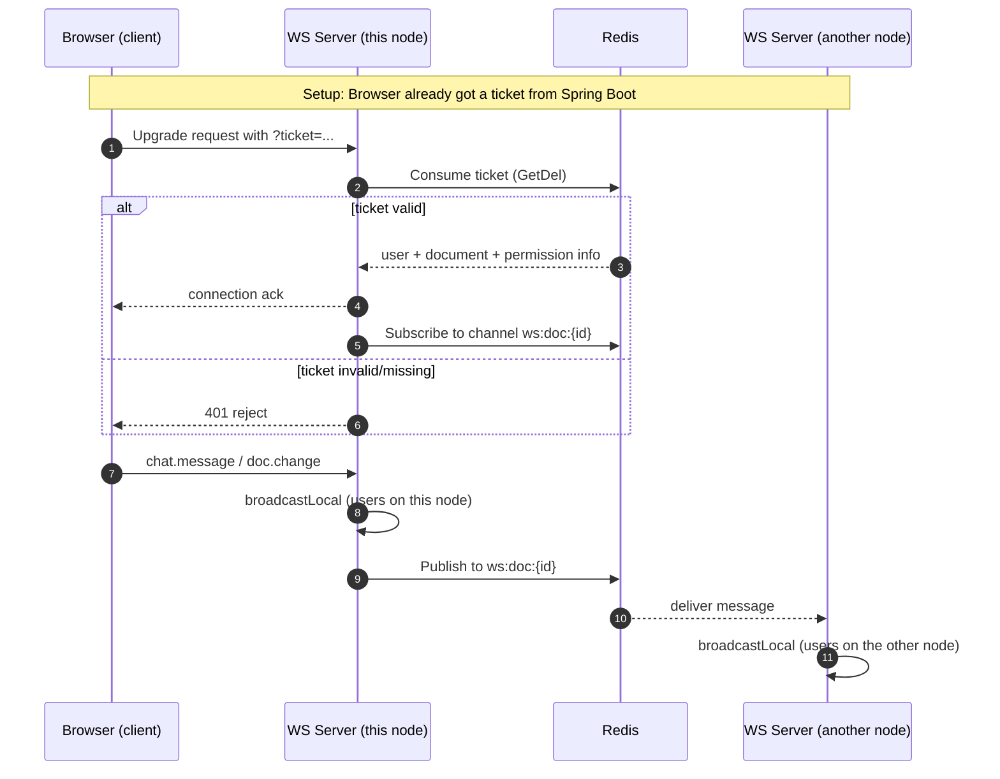

# WS Service

The websocket service is the real-time collaboration layer of the editor. Its
job is simple on purpose: **transport only**. It moves messages between people
collaborating on the same document.

It does **not** handle authentication, permissions, or any document logic. Those
belong to the Spring Boot backend (the "source of truth"). The websocket server
just relays bytes back and forth, and lets the backend decide who is allowed in.

## What the service does

- Accepts websocket connections from browsers.
- Groups connected users into **rooms** — one room per document.
- When someone in a room sends a message, it broadcasts that message to
  everyone else in the room (including users on *other* server nodes).
- Keeps connections alive with ping/pong heartbeats, and drops clients that are
  too slow to keep up.

## How it stays simple

Because there may be many websocket server instances running behind a load
balancer (HAProxy), the service talks to **Redis** for two things:

1. **Ticket store** — a short-lived auth token issued by the backend.
2. **Pub/sub broker** — to spread messages across all server nodes so everyone on
   a document receives them.

A single Redis instance serves both purposes.

## Package map

The code is split into small packages, each with one responsibility:

| Package      | Responsibility |
|--------------|----------------|
| `config`     | Reads configuration from environment variables |
| `auth`       | Validates tickets (the "login" of the websocket world) |
| `protocol`   | Defines the message format (`Envelope` + payloads) |
| `broker`     | Talks to Redis pub/sub to reach other server nodes |
| `hub`        | Manages rooms and clients on one server node |
| `ws`         | Accepts websocket connections and wires everything together |
| `cmd/ws-server` | The `main` entrypoint — startup and graceful shutdown |

## Where to look

These docs walk through the service in the order it runs:

1. [Configuration](config.md) — how the server is set up.
2. [Protocol](protocol.md) — how messages are shaped and typed.
3. [Auth (the ticket pattern)](auth.md) — how a user is allowed in.
4. [Message flow](broker.md) and [hub.md](hub.md) — how a message moves from
   one client to all the others.
5. [Connection handler](ws.md) — how a websocket connection is born, and what
   context vs. `context.Background` means.
6. [Lifecycle](lifecycle.md) — startup, health checks, and graceful shutdown.

## End-to-end message flow

