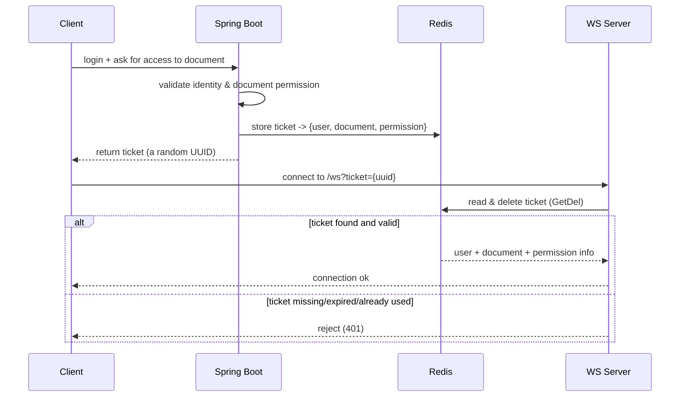

# Authentication with Tickets

Authentication for the websocket service comes down to one question: **"is this
user allowed to connect to this document?"** The answer lives in the Spring Boot
backend, and the websocket server trusts it.

## Why not JWT?

At first glance it seems simpler to share the backend's JWT secret with the
websocket servers, and just let them verify the JWT themselves. Why create a whole
new ticket mechanism? There are a few reasons.

### 1. Headers can't be sent on websocket upgrades

A websocket connection starts as an HTTP request that gets *upgraded*. You cannot
attach custom headers to an upgrade request — extra data can only go in the URL
parameters.

You might think: run a normal HTTP request first with the auth header, have the
websocket server remember it, then pass along a short-lived identifier in the
URL. But there is HAProxy in the middle. Either:

- the request must reach the **same** server node again, or
- you need a **shared** store (like Redis) anyway.

Both add moving parts.

### 2. JWT in the URL is bad practice

You *could* just put the JWT in the URL parameters. It is considered bad practice
in general, though the access tokens here are in-memory and expire quickly, so it
would probably have been "fine". Still, the ticket approach is cleaner: the
ticket is **single-use** and revoked the moment its purpose is fulfilled. You don't
have to hope the client refreshes before a stolen token expires — there's simply
nothing to steal that stays valid.

### 3. Document permissions can't be verified from a JWT

A JWT only proves *who* the user is, not *what they may do on a document*. That
permission info lives in the database, so verifying it requires the backend
either way. The websocket server would have to:

- talk to the database directly, or
- act as a client of the Spring Boot service to check permissions.

This makes the websocket server responsible for things outside its specialty.

## The ticket pattern

The solution is to separate concerns cleanly:

- **Spring Boot** handles auth and permissions (its specialty), then issues a
  ticket.
- **The websocket server** only does transport (its specialty), trusting the
  ticket.



## What is stored on Redis

The ticket itself is just a random UUID. What's *interesting* is what the backend
stores next to it, so the websocket server knows who is connecting and what they
may do:

| Field                     | Purpose                                                           |
|---------------------------|-----------------------------------------------------------------|
| `DocumentID`              | Which document this ticket grants access to.                     |
| `PermissionLevel`         | Whether the user is an `editor` or a `viewer`.                   |
| `UserID`                  | Who the user is.                                                 |
| `Username`                | Lets the server emit `participant joined/left` messages.         |
| `IssuedAt` / `ExpiresAt`  | When the ticket was issued and when it stops being valid.        |

Since the backend *writes* all of this, the websocket server gets the full picture
for free — it never queries a database.

## The code

The `auth` package is small. Two key ideas:

### An interface in front of the store

The websocket server depends on a `TicketStore` **interface**, not the concrete
Redis implementation:

```go
type TicketStore interface {
    Consume(ctx context.Context, ticket string) (*TicketPayload, error)
}
```

Only one implementation exists today (`RedisTicketStore`), but the interface keeps
the rest of the code decoupled and easy to test.

### `GetDel` — read and delete in one step

The `Consume` method is where the magic of single-use tickets happens. It uses
Redis's `GetDel`, which fetches a value **and deletes it** in a single operation:

```go
raw, err := s.client.GetDel(ctx, key).Result()
```

This is why a ticket can only be used **once**. The first websocket server to grab
it wins; a second attempt finds nothing and is rejected. No race between "read"
and "delete" — it's atomic.

After fetching, `Consume` runs a few sanity checks:

- the stored payload must parse as a `TicketPayload`,
- the ticket must not be past its `ExpiresAt`,
- the `DocumentID` and `UserID` must be positive.

### Key building

Each ticket key is namespaced under a prefix, so Redis keys don't collide with
other data in the same instance:

```go
func (s *RedisTicketStore) key(ticket string) string {
    return s.prefix + ticket
}
```

The `prefix` is its own field on the store, which makes it configurable and easy
to keep flexible.

## Summary

- The websocket server trusts tickets issued by Spring Boot and validated against
  Redis.
- Tickets are **single-use**, expired, and namespaced — they can't be replayed.
- The websocket server stays a pure transport layer; auth and permissions stay
  with the backend.