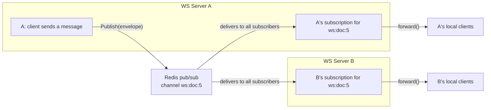

# Broker

The `broker` package is the websocket server's link to **Redis pub/sub**. Its job
is to spread messages to **other** websocket server nodes.

Remember: one websocket server only handles the clients connected to *it*. But a
document, and the people editing it, can be spread across many nodes behind
HAProxy. The broker is how a message typed on node A reaches a reader on node B.

## The two core operations

The broker has exactly two responsibilities: **publish** and **subscribe**. Both
are tied to a **channel**, which is unique to a document (`ws:doc:{documentId}`).

### The interfaces

Just like `auth`, the code programs to **interfaces** rather than Redis directly:

```go
type Subscription interface {
    Messages() <-chan []byte // channel to receive forwarded messages
    Close() error
}

type Broker interface {
    Publish(ctx context.Context, channel string, payload []byte) error
    Subscribe(ctx context.Context, channel string) (Subscription, error)
}
```

Notice the design choice: instead of making a "channel" object that owns publish
and subscribe, both methods live on the `Broker` and take the channel name as an
argument. This is a flatter, less nested design than one might expect.

## The `EnvelopeMessage`

When a node publishes a message to Redis, it wraps the regular `protocol.Envelope`
with the *origin node's ID*:

```go
type EnvelopeMessage struct {
    OriginNodeID string            `json:"originNodeId"`
    Envelope     protocol.Envelope `json:"envelope"`
}
```

This is how a node recognizes its **own** messages coming back from Redis and
ignores them — otherwise it would re-broadcast its own messages to its own clients
(twice).

## How publish works

`Publish` is thin — it hands off to the shared Redis client:

```go
func (b *RedisBroker) Publish(ctx context.Context, channel string, payload []byte) error {
    return b.client.Publish(ctx, channel, payload).Err()
}
```

## How subscribe works

`Subscribe` is more involved, because a subscription has a life of its own. It
returns a `Subscription` object that wraps go-redis's `*redis.PubSub`.

```go
func (b *RedisBroker) Subscribe(ctx context.Context, channel string) (Subscription, error) {
    pubsub := b.client.Subscribe(ctx, channel)
    if _, err := pubsub.Receive(ctx); err != nil { // confirm the network works
        _ = pubsub.Close()
        return nil, err
    }
    sub := &redisSubscription{
        pubsub:   pubsub,
        messages: make(chan []byte, 256), // application-level channel
        done:     make(chan struct{}),
    }
    go sub.forward() // pull from go-redis, push to our channel
    return sub, nil
}
```

### Why the extra `messages` channel?

go-redis's `pubsub.Channel()` already returns a channel. Why re-forward it to our
own `messages` channel? The reason is **owning the lifecycle**. The rest of the app
never touches go-redis's channel. It reads from `Messages()`, and when it's done
it can rely on `forward()` closing `messages` when the goroutine stops. This gives
the application a stable, predictable channel to consume from.

### The `forward()` goroutine

This is where messages flow from Redis to the app:

```go
func (s *redisSubscription) forward() {
    defer close(s.messages)            // always close our channel when we exit
    ch := s.pubsub.Channel()           // go-redis's channel

    for {
        select {
        case <-s.done:                 // someone asked us to stop
            return
        case msg, ok := <-ch:          // a message arrived from Redis
            if !ok {
                return
            }
            // block if our channel is full (backpressure)
            select {
            case s.messages <- []byte(msg.Payload):
            case <-s.done:
                return
            }
        }
    }
}
```

There are a few important patterns here:

- **`done` channel for cancellation.** `done` never carries data; it exists only
  to be *closed*. Closing a channel makes every `<-done` case in a `select`
  immediately ready, so other parts of the app can cleanly stop the goroutine.
- **Blocking with backpressure.** The `select` keeps the goroutine parked (using
  no CPU) until either a message arrives or the subscription is closed. The inner
  `select` handles the case where `messages` is full — it waits instead of
  overwriting.
- **`defer close(s.messages)`** guarantees consumers of `Messages()` see the
  channel close when the subscription ends, so they can stop cleanly.

### Why `Receive()` is called

`pubsub.Receive()` acts as a **confirmation** that the subscription actually
established on the network *before* we consider it ready. If it fails, we close
the pubsub and return an error instead of starting a goroutine that would silently
produce nothing.

### `sync.Once` — close only happens once

```go
func (s *redisSubscription) Close() error {
    s.once.Do(func() {
        close(s.done)
        _ = s.pubsub.Close()
    })
    return nil
}
```

The `sync.Once` guarantees `close(s.done)` runs exactly once, even if `Close()` is
called from several goroutines. Closing a channel twice would panic; `sync.Once`
prevents that.

## The full picture



Note that node A's subscription will receive its **own** published message too.
That's why `EnvelopeMessage.OriginNodeID` exists — node A sees its own node ID and
ignores the message so it isn't delivered to A's clients twice.