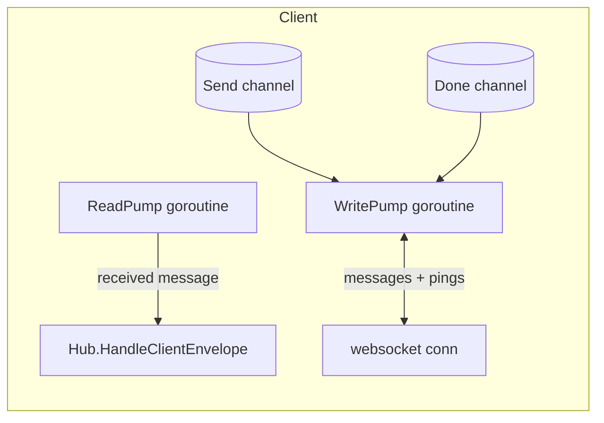
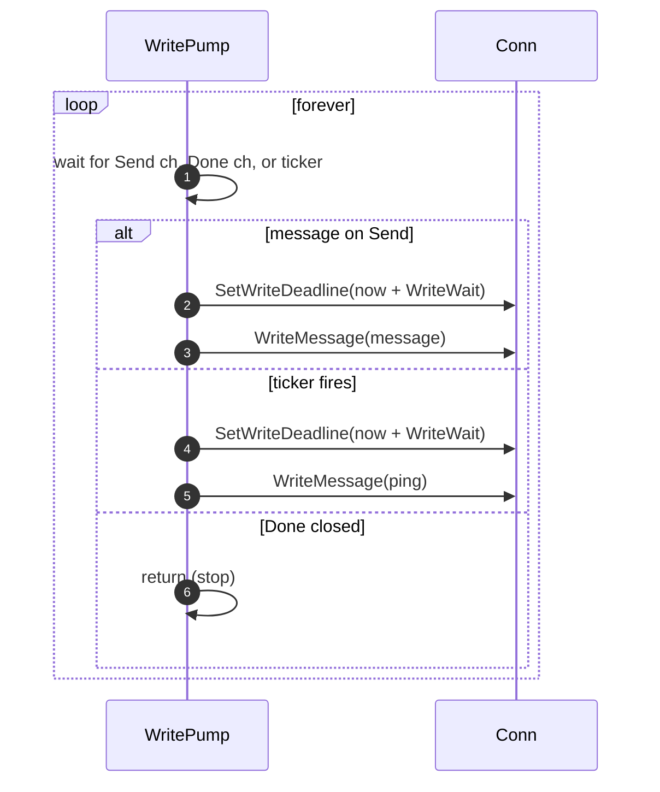
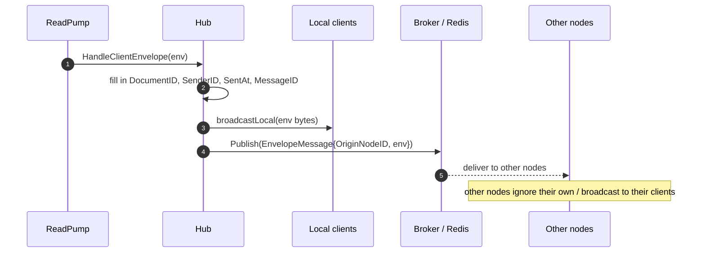
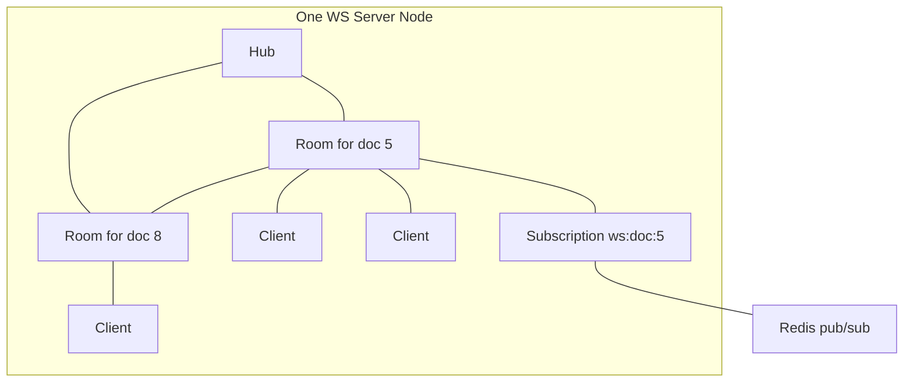

# Hub

The `hub` package is the **core** of message distribution on a single server node.
This is where the service manages its document sessions (`Room`s) and the people
connected to them (`Client`s).

The package has three concepts:

| Concept  | What it represents                                   |
|----------|------------------------------------------------------|
| `Client` | A single connected user and their websocket.         |
| `Room`   | One document session — the clients editing one doc.  |
| `Hub`    | All the rooms this server node currently handles.    |

## The `Hub` and `Room`

A `Hub` keeps a map of `documentId -> *Room`, guarded by a read/write mutex. It
owns the single `Broker` used by all rooms on this node.

```go
type Hub struct {
    nodeID string
    broker broker.Broker // one broker for all rooms
    mu     sync.RWMutex  // maps are not thread-safe
    rooms  map[int64]*Room
}

type Room struct {
    clients map[*Client]struct{} // clients on this node, in this doc
    sub     broker.Subscription  // one subscription shared by the room
}
```

Each `Room` holds:

- the set of `Client`s **on this node** for that document, and
- **one** shared Redis `Subscription`. Everyone in the room listens on the same
  channel, so there's a single subscription per room rather than per client.

### Why the mutex?

Go maps are **not thread-safe**. Many goroutines read and write the `rooms` map at
the same time (clients joining/leaving, messages being distributed). Without a
mutex this would be a race condition. `sync.RWMutex` lets many goroutines read at
once but only one write.

> Design note: connecting, routing, and disconnecting are all methods on `Hub`.
> You might expect them on `Room`, but the `Hub` coordinates rooms and doesn't
> touch websocket connections directly — that's left to `Client`.

## `Client` — the only thing that touches the socket

Only `Client` members interact with the gorilla/websocket connection object. This
keeps websocket logic in one place. `Client` holds the connection, some metadata
(user, document, permission), and configuration for heartbeats and limits.

A `Client` also has two important channels:

- `Send` — a **buffered** channel of `[]byte` messages to be written to the
  socket.
- `Done` — closed to signal the client connection is shutting down.

### The two goroutines

Almost all message traffic runs through two goroutines per client:



#### `WritePump` — sending and heartbeats

`WritePump` constantly waits on the `Send` channel. Whenever a message arrives, it
extends the **write deadline** and writes the message to the socket. It also runs
a **ticker** that periodically sends a **ping**.



Why pings? Gorilla websocket maintains a **write deadline**. If nothing is written
to the socket before the deadline, the connection is considered dead and gets
terminated. Each new message *or* ping extends the deadline, so the connection
stays alive as long as traffic (or heartbeats) keep flowing.

> Note: ping/pong normally feels like a low-level concern, but Gorilla leaves it
> to the app. The good news is the **client side needs nothing** — the browser's
> websocket API answers pings automatically. It's the server's job to ping.

#### `ReadPump` — receiving and validation

`ReadPump` uses Gorilla's `ReadMessage`, which **blocks** until a message or an
error arrives. Unlike `WritePump`, there's no incoming channel — `ReadMessage`
drives it directly.

When a message arrives, `ReadPump`:

1. Checks the message type is text or binary (skips control frames).
2. Validates it parses as a `protocol.Envelope`.
3. Runs **message-type-specific** checks:
   - For a **chat** message: the payload must exist, be valid JSON, not empty
     after trimming, and no longer than 2000 characters.
   - For a **document change**: it's passed straight through.
4. Hands valid messages to `Hub.HandleClientEnvelope`; sends a `SendError` for
   anything invalid.

Alongside reads, `ReadPump` also sets a **read deadline** and installs a **pong
handler**. Whenever the browser answers a ping with a pong, the handler extends the
read deadline — keeping a dead connection from lingering.

> Note: much of this validation *could* live on the frontend, but having it here
> as a guard is defensive. It does mean unmarshalling and marshalling happen
> server-side, which feels slightly redundant.

### `Close` and `MarkUnregistered` — run once

Both use `sync.Once` so they're idempotent:

- `Close()` closes `Done` and the connection only once.
- `MarkUnregistered()` returns `true` only on the *first* call, so a client that's
  already being removed isn't unregistered again.

## Routing through the Hub

The `Hub` is the coordinator. Its main methods:

### `Register` — a client joins

When a client connects, `Register` finds (or creates) the room for the client's
document. For a brand-new room it subscribes on the broker and starts a
`consumeRoom` goroutine. Then it adds the client to the room and emits a
`participant joined` event to everyone.

### `Unregister` — a client leaves

`Unregister` removes the client from its room. If the room becomes empty, the room
is deleted and its Redis subscription is closed (a `Hub` has as many subscriptions
as active rooms). It emits a `participant left` event and closes the client's
connection.

### `HandleClientEnvelope` — a message from a client

Called by `ReadPump` with a validated envelope. It:



It stamps the envelope with the current `DocumentID`, `SenderID`, `SentAt`, and a
generated `MessageID`, then:

1. **Broadcasts locally** — sends the raw bytes to every client of this room on
   *this* node.
2. **Publishes to the broker** — wraps the envelope with `OriginNodeID` and
   publishes it so clients on *other* nodes receive it too.

> Note: the local broadcast and the broker publish overlap somewhat — the message
> returns from Redis and is broadcast again. That's why `OriginNodeID` filtering
> (in `consumeRoom`) matters: a node must not double-send to its own clients.

### `consumeRoom` — messages from Redis

A goroutine per room that reads from the room's shared subscription. For each
message it:

1. Unmarshals it into an `EnvelopeMessage`.
2. Checks `OriginNodeID` — if it's **this** node, skip it (we already broadcast
   locally).
3. Marshals the inner envelope and broadcasts it to local clients.

### `broadcastLocal` and slow clients

The most interesting method. It sends a message to every local client in a room.
The subtlety: **what if a client's `Send` buffer is full?**

Without care, pushing to a full channel would block the goroutine, freezing
message delivery for *everyone else* in the room. The trick is the `default` case:

```go
for _, client := range clients {
    select {
    case client.Send <- message: // fast client — buffer has room, send now
    default:
        slow = append(slow, client) // slow client — buffer is full
    }
}
```

Fast clients get the message immediately. Clients whose buffers are full get
collected as **"slow"** clients and are then forcefully disconnected (`Close`). A
slow client is usually one on a bad connection that can't keep up; it's better to
drop it than to stall the whole room.

## Summary diagram



- `Hub` owns all rooms.
- Each room = one document + its local clients + one shared subscription.
- Each client runs `ReadPump` and `WritePump`.