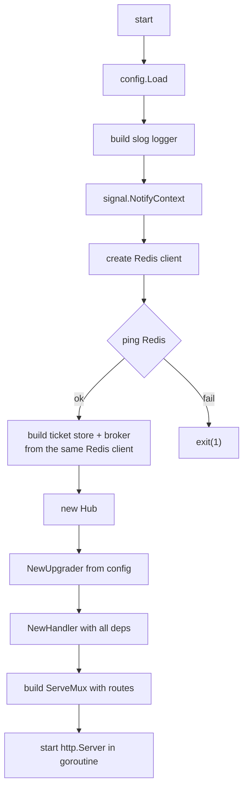

# Lifecycle (`main`)

`cmd/ws-server/main.go` is the entrypoint. It ties together `config`, `auth`,
`broker`, `hub`, and `ws`, then starts an HTTP server and handles graceful
shutdown.

## Startup

The sequence in `main()`:



1. **Load config** — read all settings from the environment.
2. **Build a logger** — JSON logs to stdout, at the configured level.
3. **Create a context that's cancelled on shutdown signals.** The
   `signal.NotifyContext` line:

   ```go
   ctx, stop := signal.NotifyContext(context.Background(), os.Interrupt, syscall.SIGTERM)
   defer stop()
   ```

   This connects the context to OS signals: `os.Interrupt` (Ctrl+C) and
   `syscall.SIGTERM` (the normal way containers/`docker stop` ask a process to
   stop). When either signal arrives, `ctx` gets cancelled. This is what drives the
   shutdown below.
4. **Create the Redis client** and **ping it** to confirm it's reachable before
   starting. If it's not reachable, the server exits with code 1 (fail fast —
   better than starting and being unable to route messages).
5. **Build the pieces** — *one* Redis client is shared by both the ticket store
   and the pub/sub broker.
6. **Build the HTTP mux** with routes and start the server in a goroutine.

## Routes

| Route     | Purpose                                                        |
|-----------|---------------------------------------------------------------|
| `/healthz`| Liveness check — always returns `ok` if the process is up.     |
| `/readyz` | Readiness check — returns `ok` only if Redis is reachable.     |
| `/ws`     | The websocket endpoint (the main `Handler`).                   |

The readiness probe (`/readyz`) is different from the liveness probe (`/healthz`):
a process can be *alive* but *not ready* to serve (e.g. Redis is down). Load
balancers and orchestrators use these to route traffic only to healthy nodes.

## Request logging

Every request gets wrapped in `requestLogger`, which logs the method, path, remote
address, and how long the request took — convenient for debugging.

## Graceful shutdown

The server runs in a goroutine, and `main` blocks on a `select`:

```mermaid
sequenceDiagram
    autonumber
    participant OS
    participant Main
    participant S as http.Server

    Note over OS,Main: normal run
    Main-->>S: ListenAndServe (goroutine)

    alt shutdown signal (SIGINT / SIGTERM)
        OS-->>Main: context cancelled (ctx.Done)
        Main->>S: Shutdown(10s timeout)
        S-->>Main: drains in-flight requests, closes
        Main->>Main: log "server shutdown complete"
    else server errors
        RT--xMain: errCh receives error
        alt real error
            Main->>Main: log failure, exit(1)
        else ErrServerClosed
            Main->>Main: clean exit
        end
    end
```



The key idea is **graceful** shutdown: instead of killing connections abruptly,
the server is given `Shutdown` with a 10-second timeout. This lets in-flight
websocket/HTTP requests finish and connections drain before the process exits. If
shutdown doesn't finish in time, it logs an error and exits non-zero.

Two paths can end the `select`:

- **Signals** (`ctx.Done`) → graceful shutdown.
- **Server error** → if it's not the benign `http.ErrServerClosed`, log and exit
  with code 1.

## Why signals matter in containers

The `docker stop` command sends `SIGTERM` to the main process. Without signal
handling, the process would be killed instantly. With `signal.NotifyContext` and a
graceful `Shutdown`, the service gets the chance to finish cleanly — which is
especially important for a server managing many open websocket connections.