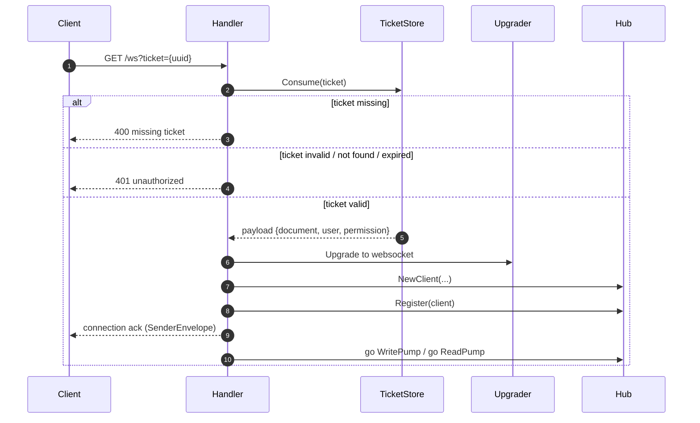

# Connection handler (`ws`)

The `ws` package is where a websocket connection is **born**. It takes an incoming
HTTP upgrade request, validates the ticket, upgrades the connection, and wires the
new client into the hub.

It's a thin layer — it mostly builds objects and kicks off goroutines.

## The flow of a new connection

Everything follows from `Handler.ServeHTTP`:



1. **Ticket from the URL.** The ticket comes in via a URL query parameter
   (`?ticket=...`) — remember, websocket upgrades can't carry headers. If it's
   missing, return `400`.
2. **Consume the ticket** with a short timeout. Any error maps to a rejection
   (`401`). Because `GetDel` deletes the ticket, a ticket is single-use.
3. **Upgrade** using the `websocket.Upgrader`, turning the HTTP request into a
   websocket connection.
4. **Build the `Client`** from the ticket payload (user, document, permission)
   plus tuning values from config.
5. **Register** the client on the hub. This joins the room and (for a new room)
   subscribes on the broker.
6. **Send a connection ack** so the browser knows it's connected and gets back
   its own info (loaded from the ticket payload).
7. **Start the pumps** — `WritePump` and `ReadPump` run as goroutines, and the
   handler returns.

## The upgrader

`NewUpgrader` configures the `websocket.Upgrader`:

- Sets read/write buffer sizes.
- **`CheckOrigin`** — the security gate. By default, browsers won't let a
  websocket connect from a different origin, and Gorilla needs this function to
  decide. It allows connections only from origins in the allowed list (which
  comes from config). An empty list means "allow any" (useful for dev, dangerous
  in prod).
- Compression is off.

## Contexts: `r.Context()` vs `context.Background()`

You'll see both `context.Context` values floating around. Here's why they differ.

### `r.Context()` — tied to the HTTP request

In an HTTP server, `r.Context()` carries things like request-scoped values and is
**cancelled when the HTTP request ends**. During the upgrade handshake we use it
for operations that should be tied to *that* request — e.g. the ticket
`Consume` with a timeout.

```go
ticketCtx, cancel := context.WithTimeout(r.Context(), 3*time.Second)
payload, err := h.ticketStore.Consume(ticketCtx, ticket)
cancel()
```

### `context.Background()` — tied to the connection

Here's the subtle part: once the websocket **upgrade completes**, the HTTP request
is considered "finished", so `r.Context()` would be cancelled immediately. If we
passed `r.Context()` into the long-running pumps, they'd be torn down right away.

The websocket connection is meant to live **much longer** than the HTTP request
that spawned it. So the code deliberately uses `context.Background()` for things
that must survive for the life of the connection:

```go
func (c *Client) ReadPump(h *Hub) {
    defer h.Unregister(context.Background(), c)
    ...
    h.HandleClientEnvelope(context.Background(), c, outgoing)
}
```

> Broader context: a `context` is a way to control cancellation across goroutines,
> usually by cancelling it from elsewhere in the code. In this service, cancellation
> isn't wired up to the connection lifecycle via context — the pumps stop through
> their own channels (`Done`, closing sockets) — which is why `context.Background()`
> is acceptable here. But passing the wrong context (the request one) would be a
> real bug.

## Building a handler

`NewHandler` takes an `HandlerDeps` struct that injects everything the handler
needs — logger, hub, ticket store, upgrader, and config. This dependency-injection
style keeps the handler easy to construct and test.